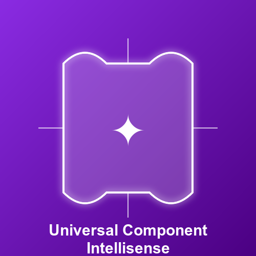

<p align="center">

</p>
<p align="center"> English | <a href="https://github.com/common-intellisense/common-intellisense/blob/main/README_zh.md">简体中文</a></p>

This plugin can provide a super powerful smart prompt function, including properties, events, slots and corresponding annotations and types, methods on instances, etc. It supports multiple UI libraries, taking your development efficiency to the next level.

### 🛠️️ How to use
Install the supported ui component library in your project and install the plug-in. If the plug-in does not work, you can restart vscode. If you encounter problems, you can open an issue.

### 🍬 Currently supported
- vant 4
- element 2
- element-plus 2
- antd 1、4、5
- antdv 1、3、4
- antd-mobile 5
- varlet 2、3
- naive 2
- primevue 3、4
- quasar 2
- @nextui-org/react 2
- @nuxt/ui 2
- @nuxt/ui-pro 1
- vuetify 3
- radix-vue 1
- next-ui 2
- arco-design/react 2
- arco-design/vue 2
- uview-ui 1、2
- uview-plus 3
- taro 3
- shacn-svelte 0
- bits-ui 0
- material-ui 5
- shadcn-ui 0
- tiny-vue 3
- nutui 4
- uview-plus 1
- tdesign-vue-next 1
- tdesign-mobile-vue 1
- tdesign-react 1
- tdesign-miniprogram 1
- @headlessui/vue 1
- @headlessui/react 2
- @chakraUi/react 2

### [antdv demo](assets/antdv.gif)

### [varlet demo](assets/varlet.gif)

### [vant demo](assets/vant.gif)

### [antd demo](assets/antd.gif)

### [element-ui demo](assets/element.gif)

### [naive-ui demo](assets/naive.gif)

### [nuxt-ui demo](assets/nuxt-ui.gif)

### [vuetify demo](assets/vuetify.gif)

### [radix-vue demo](assets/radix-vue.gif)

### [next-ui demo](assets/next-ui.gif)

### [arco-design/react demo](assets/arco-design.gif)

### [arco-design/vue demo](assets/acro-design-vue.gif)

### [shadcn-svelte demo](assets/shadcn-svelte.gif)

### [bits-ui demo](assets/shadcn-svelte.gif)

## Select the specified UI library (resolve multiple UI library naming conflicts)

- `cmd+shift+p` -> Select `Specify the UI library you need to prompt`

## configuration

```json
{
  "common-intellisense.showSlots": {
    "type": "boolean",
    "default": true,
    "description": "Whether to show the slots on template completion."
  },
  "common-intellisense.alias": {
    "type": "object",
    "default": {},
    "description": "If you need to integrate the supported ui library, the secondary encapsulated library, and the prompt to integrate a certain version of the original ui, you can use the alias { \"@xxx/element\": \"elementUi2\" }"
  },
  "common-intellisense.remoteUris": {
    "type": "array",
    "default": [],
    "description": "Remote URIs"
  },
  "common-intellisense.remoteNpmUris": {
    "type": "array",
    "default": [],
    "description": "Remote NPM URIs"
  },
  "common-intellisense.localUris": {
    "type": "array",
    "default": [],
    "description": "Local URIs"
  }
}
```

## Explain Configuration
- remoteUris: When you deploy the index.cjs configuration file to an online address
- remoteNpmUris：When you deploy the index.cjs configuration file to npm, you only need to provide the package name instead of the full URL.
- localUris：When you want to test your configuration, you can read the generated index.cjs locally

## How to Contribute

This repository is maintained by individuals, and needs to be updated with some UI libraries frequently. If you are interested in contributing, you can submit a PR to the corresponding version of the corresponding UI library under @common-intellisense or provide some new UI libraries or some new features. Submissions are welcome. [issue](https://github.com/common-intellisense/common-intellisense/issues/3)

## How to support private libraries

If your project is a private library, you can also refer to [vuetify](https://github.com/common-intellisense/vuetify3), provide an exported uri, if your uri is an accessible packaged `dist/index.cjs` address, in vscode `common-intellisense.remoteUris`, configure this link, the plug-in will request this link and get the corresponding prompt information. You can also directly configure an npm package name (@xx/yy-ui), configure it in `common-intellisense.remoteNpmUris`, so that the plug-in will request the `dist/index.cjs` produced by the npm package and get the corresponding prompt information.

## How to configure the component's JSON
```json
{
  "name": "componentName like Button.Grop or VButton(Big CamelCase Format)",
  "props": {
    "attributeName": {
      "default": "defaultValue",
      "value": "if have will generate attribute with=\"value\"",
      "type": "if you use -> boolean / top / end / bottom / start will have option when create attribute",
      "description": "en description",
      "description_zh": "zh description",
      "required": true, // if with true when select component will auto has this attribute
      "foreach": false // it only work with vue, when you want generate with v-for
    }
  },
  "link": "en link to document",
  "link_zh": "zh link to document",
  "typeDetail": { // Used to supplement other types of descriptions in the attribute dependencies
    "AnchorItem": [ // if name startsWith '$' like "$AnchorItem", will be type AnchorItem = 'x' | 'y'
      {
        "name": "key",
        "description": "Unique ID",
        "type": "string | number"
      }
    ]
  },
  "events": [
    {
      "name": "close",
      "description": "Emitted when close icon is clicked.",
      "description_zh": "单击关闭图标时发出。",
      "params": "[MouseEvent]"
    }
  ],
  "exposed": [ // when use ref get vm, vm.value or vm.current will get this hints
    {
      "name": "[string]",
      "description": "MISSING DESCRIPTION (edit in github)",
      "description_zh": "MISSING DESCRIPTION (edit in github)",
      "detail": "any"
    }
  ],
  "suggestions": [ // Some components are combined，when use button-group, inner tip will this `button` reminder will be brought forward, if this components with only one suggestions, it will select button-group auto create button
    "v-alert-title"
  ]
}
```

## How to configure custom [instructions](https://github.com/common-intellisense/vuetify/blob/main/src/directives.json)

## Frequently asked questions
- If you find that the code prompts are repeated, it may be because the plug-in has been upgraded, but the old version of the plug-in is still in effect. Try to enter the vscode plug-in directory `code ~/.vscode/extensions`, then delete the low version `simonhe.common-intellisense-low-version`, and restart vscode.
- If you encounter [All promises were rejected], you can try to uninstall and reinstall the plugin, or check the local network proxy, because the plugin will request NPM packages from different sources through multiple channels. If your network proxy is not connected, this problem may occur

## :coffee:

[Sponsor Common Intellisense](https://github.com/Simon-He95/sponsor)

## License

[MIT](./license)

## Sponsors

<p align="center">
  <a href="https://cdn.jsdelivr.net/gh/Simon-He95/sponsor@main/sponsors.svg">
    
  </a>
</p>
