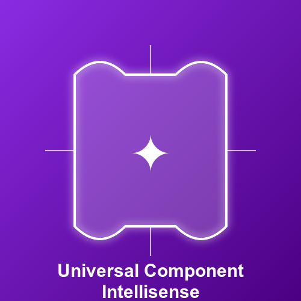

<p align="center">

</p>
<p align="center"> <a href="https://github.com/Simon-He95/vscode-common-intellisense/blob/main/README.md">English</a> | 简体中文</p>

此插件能够提供超级强大的智能提示功能，包含属性、事件、插槽以及对应的注释和类型，实例上的方法等等，支持多个 UI 库，让你的开发效率更上一层楼。

### 🛠️️ 如何使用
在你的项目中安装已支持的 ui 组件库并安装此插件即可。如果插件不能生效，可以重启 vscode，如遇到问题可以打开一个 issue

### 🍬 目前支持
- vant 4
- element-ui 2
- element-plus 2
- antd 1、4、5
- antdv 3、4
- antd-mobile 5
- varlet 2、3
- naive 2
- primevue 3、4
- quasar 2
- @nextui-org/react 2
- @nuxt/ui 2
- @nuxt/ui-pro 1
- vuetify 3
- radix-vue 1
- next-ui 2
- arco-design/react 2
- arco-design/vue 2
- uview-ui 1、2
- uview-plus 3
- taro 3
- shacn-svelte 0
- bits-ui 0
- material-ui 5
- shadcn-ui 0
- tiny-vue 3
- nutui 4
- uview-plus 1
- tdesign-vue-next 1
- tdesign-mobile-vue 1
- tdesign-react 1
- tdesign-miniprogram 1
- @headlessui/vue 1
- @headlessui/react 2
- @chakraUi/react 2
- wot-design-uni 1

### [antdv demo](assets/antdv.gif)

### [varlet demo](assets/varlet.gif)

### [vant demo](assets/vant.gif)

### [antd demo](assets/antd.gif)

### [element-ui demo](assets/element.gif)

### [naive-ui demo](assets/naive.gif)

### [nuxt-ui demo](assets/nuxt-ui.gif)

### [vuetify demo](assets/vuetify.gif)

### [radix-vue demo](assets/radix-vue.gif)

### [next-ui demo](assets/next-ui.gif)

### [arco-design/react demo](assets/arco-design.gif)

### [arco-design/vue demo](assets/acro-design-vue.gif)

### [shadcn-svelte demo](assets/shadcn-svelte.gif)

### [bits-ui demo](assets/shadcn-svelte.gif)

## 选择指定的 UI 库（解决多个UI库命名冲突）

- `cmd+shift+p` -> 选择 `Specify the UI library you need to prompt`

## configuration 设置

```
"common-intellisense.showSlots": {
          "type": "boolean",
          "default": true,
          "description": "控制是否要展示 slots 节点"
},
"common-intellisense.alias": {
          "type": "object",
          "default": {},
          "description": "如果你需要将基于支持的 ui 库，二次封装的库，集成原本 ui 某一个版本的提示，可以使用别名 { \"@xxx/element\": \"elementUi2\" }"
},
"common-intellisense.remoteUris": {
    "type": "array",
    "default": [],
    "description": "远程URI (Remote URIs)"
  },
  "common-intellisense.remoteNpmUris": {
    "type": "array",
    "default": [],
    "description": "远程NPM URI (Remote NPM URIs)"
  },
  "common-intellisense.localUris": {
    "type": "array",
    "default": [],
    "description": "本地URI (Local URIs)"
  }
```

## 如何参与贡献

此仓库是个人维护, 需要经常同步一些 ui 库的更新,如果你有兴趣参与贡献,可以提交 PR 到对应 @common-intellisense 下的对应 UI 库所对应的版本 或者提供一些新的 ui 库,或者提供一些新的功能,欢迎提交 [issue](https://github.com/common-intellisense/common-intellisense/issues/3)

## 如何支持私有库

如果你的项目是私有库，你同样可以参考 [vuetify](https://github.com/common-intellisense/vuetify3), 提供一个导出的 uri，如果你的 uri 是一个可访问的的打包后的 `dist/index.cjs` 的地址，在 vscode `common-intellisense.remoteUris`，配置这个链接，插件会去请求这个链接，获取对应的提示信息。你也可以直接配置一个 npm 包名(@xx/yy-ui)， 在 `common-intellisense.remoteNpmUris` 中配置，这样插件会去请求 npm 包产出的 `dist/index.cjs`，获取对应的提示信息。[B 站视频](https://www.bilibili.com/video/BV1zn2oYUEQG/)

## 如何配置组件的json
```json
{
  "name": "组件名称如 Button.Grop 或 VButton(大驼峰命名格式)",
  "props": {
    "attributeName": {
      "default": "默认值",
      "value": "如果有将生成属性 with=\"value\"",
      "type": "如果你使用 -> boolean / top / end /bottom / start 在创建属性时会有选项",
      "description": "en 描述",
      "description_zh": "zh 说明",
      "required": true, // 如果为true时select组件会自动有这个属性
      "foreach": false // 它只适用于 vue，当你想使用 v-for 生成时
    }
  },
  "link": "en 指向文档的链接",
  "link_zh": "zh 链接到文档",
  "typeDetail": { // 用于补充属性依赖中的其他类型描述
    "AnchorItem": [ // 如果名称像 "$AnchorItem" 一样以 '$' 开头，则将被键入锚点项 = 'x' | 'y'
      {
        "name": "key",
        "description": "唯一ID",
        "type": "string | number"
      }
    ]
  },
  "events": [
    {
      "name": "close",
      "description": "单击关闭图标时发出。",
      "description_zh": "单击关闭图标时发出。",
      "params": "[MouseEvent]"
    }
  ],
  "exposed": [ // 使用 ref get vm, vm.value 或 vm.current 时会得到此提示
    {
      "name": "[string]",
      "description": "MISSING Description (edit in github)",
      "description_zh": "MISSING Description (edit in github)",
      "detail": "any"
    }
  ],
  "suggestions": [ // 一些组件是组合在一起的，当使用 button-group 时，内部提示会将此 `button` 提醒带上，如果此组件只有一个建议，则会选择button-group 自动创建按钮
    "v-alert-title"
  ]
}
```

## 如何配置自定义 [指令](https://github.com/common-intellisense/vuetify/blob/main/src/directives.json)

## 常见问题

- 如果你发现代码提示重复了，可能是因为插件升级了，但是老版本的插件仍然在生效, 尝试进入到 vscode 插件目录 `code ~/.vscode/extensions`, 然后删除低版本的 `simonhe.common-intellisense-low-version`，重启 vscode 即可
- 如果发现遇到 [All promises were rejected], 可以尝试卸载重新安装插件，或者检查本地网络代理，因为插件会多渠道请求不同源的 NPM 包，如果你的网络代理不通，可能会导致这个问题
- 如果你在内网环境或者没有网络的情况下使用，可以安装 [common-intellisense-local](https://marketplace.visualstudio.com/items?itemName=simonhe.common-intellisense-local)

## :coffee:

[赞助 Common Intellisense](https://github.com/Simon-He95/sponsor)

## License

[MIT](./license)

## Sponsors

<p align="center">
  <a href="https://cdn.jsdelivr.net/gh/Simon-He95/sponsor@main/sponsors.svg">
    
  </a>
</p>
